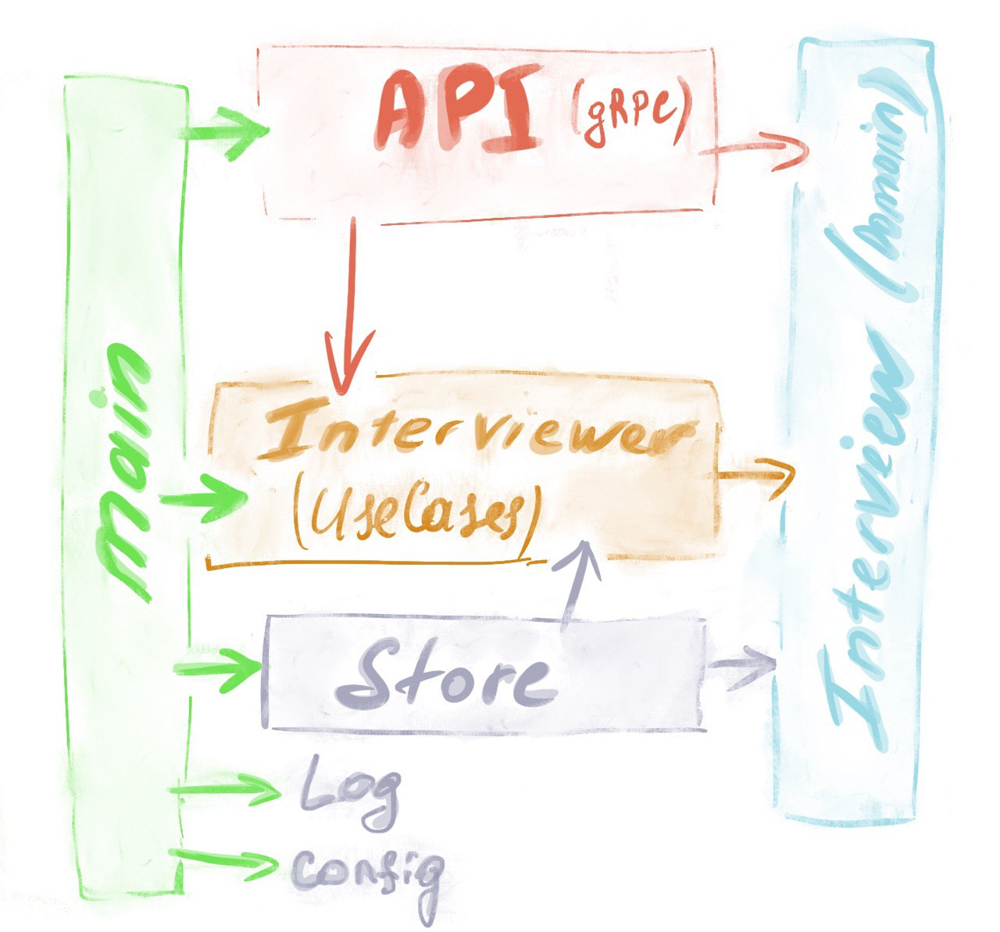

# online logical interviewer

under construction

flow:

1) HR registers the candidate (UserID enters the system).
2) The candidate asks the next question:

    - Generate the question until 30 minutes have elapsed from the first question issued
    - Generate a question before 30 questions are asked

3) the candidate answers the question, store the answer
4) send summary to the candidate
5) (optional) send an Email to HR
